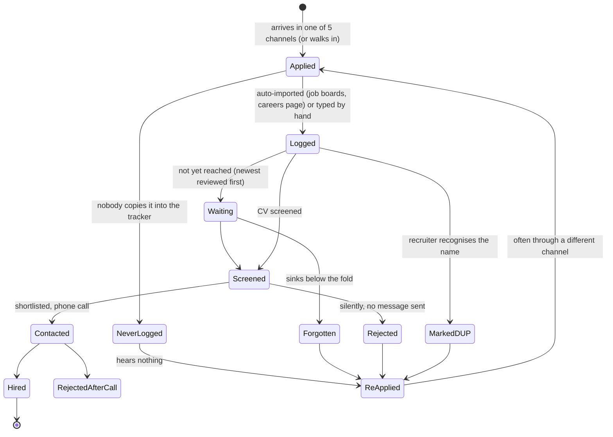
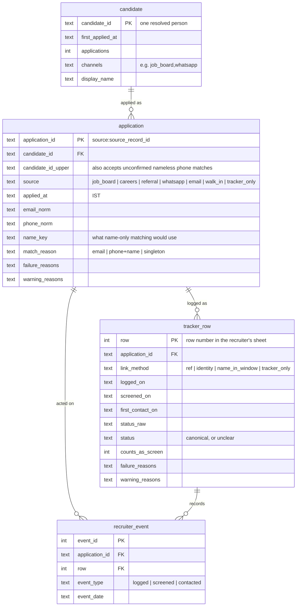

# Workflow, data model and metrics

> All client data is simulated ([simulation.md](simulation.md)).

## The workflow

Every application moves through the same lifecycle. The pipeline reconstructs it from six systems that each see
only part of it.



The loop at the bottom is the problem from Assignment 1: silence sends people back in, often through another
channel, where the recruiter meets them again as a "new" applicant, or dismisses them as a duplicate by name.

| Concept | In this project |
|---|---|
| **Entities** | Candidate (a resolved person), application, tracker row |
| **Events / states** | Applied → logged → screened / marked DUP / never reached → contacted → hired or rejected |
| **Interactions** | The applicant's own actions: each application, and each re-application |
| **Interventions** | The recruiter's actions, recorded as `recruiter_event` rows: logged, screened, contacted |
| **Outcomes** | Hired / rejected; whether the applicant heard back; whether they re-applied |

## Warehouse schema (SQLite)

Defined in [`sql/schema.sql`](../sql/schema.sql). It is organised around the candidate workflow, not around the six
source systems.



| Table | Grain | Rows (as of 31 Aug 2026) | Notes |
|---|---|---|---|
| `candidate` | one person | 2,121 | 2,025 if every unconfirmed nameless phone match is also the same person |
| `application` | one application | 2,887 | Invalid rows kept and flagged; metrics filter on `failure_reasons = ''` |
| `tracker_row` | one row of the recruiter's sheet | 2,520 | Linked by ref 1,702 · identity 728 · name-in-window 41 · no source record 49 |
| `recruiter_event` | one thing the recruiter did | 5,022 (logged 2,520 · screened 1,951 · contacted 551) | Derived from tracker dates, so each application's workflow can be read in order |

Each month's warehouse is built as a separate file (`data/warehouse_asof=<date>.sqlite`) inside one transaction, with
integrity checks (every application has a candidate, every link points at a real application) before it's committed.

## Identity resolution

This is the heart of the project. Assignment 1 assumed duplicates are found by name, and that 22% by name was a
*lower bound*. The data says otherwise.

### The rule

```text
merge automatically   <=>  same normalised email
                       OR  same normalised phone AND both names known AND compatible
send to review queue  <=>  same phone, but one side has no name (a nameless WhatsApp message)
```

- **Normalised** means: phones reduced to 10 digits (`+91 98765 43210`, `098765…` → `9876543210`); emails
  lower-cased, with Gmail's dots and `+tags` ignored (Gmail treats them as the same mailbox; other providers don't);
  placeholders (`na`, `-`, `9999999999`) treated as missing, never as an identifier.
- **Compatible names** means: same first name, and the same surname unless one side has only an initial or no
  surname (`Rahul S` fits `Rahul Sharma`; `Rahul Sharma` does not fit `Rohit Sharma`).
- An identifier shared by more than three different first names is treated as a placeholder or a hub (for
  example, a referrer's own phone), and is not used to merge.

### Why this rule: evidence from 237 recruiter-labelled pairs

| Rule | True matches found | Incorrect merges | Missed matches | Precision | Recall |
|---|---:|---:|---:|---:|---:|
| Name only (Assignment 1's method) | 117 | **36** | 62 | 76.5% | 65.4% |
| Email only | 107 | 0 | 72 | 100.0% | 59.8% |
| Phone only | 112 | 2 | 67 | 98.2% | 62.6% |
| Email or phone | 168 | 2 | 11 | 98.8% | 93.9% |
| Chosen + also auto-merge nameless phone matches | 166 | 0 | 13 | 100.0% | 92.7% |
| **Chosen** (nameless phone matches go to the review queue) | 142 | **0** | 37 | **100.0%** | 79.3% |

- **Name matching is the worst rule on both counts.** It merges different people (36 incorrect merges: common names
  collide) *and* misses the same person (62: names are written differently in each channel).
- **Phone alone makes incorrect merges** (siblings share a phone; referrers type their own).
- **"Email or phone" finds the most** but makes 2 incorrect merges. Assignment 1's guardrail is **zero incorrect
  merges**, because collapsing two people into one silently removes an applicant. So the chosen rule adds a name
  check on phone matches.
- **Nameless phone matches are the hard case.** Auto-merging them made no incorrect merges *in this sample*
  (92.7% recall), but a nameless WhatsApp message from a phone that two siblings share can't be attributed to either,
  and a single wrong guess breaks the guardrail. Zero in 237 pairs isn't zero risk. So these go to a **review queue**
  instead: 8–16 applications a month, each settled by one phone call.
- The price is recall on the labelled pairs: 79.3% instead of 92.7%. Those matches aren't lost, they're pending
  confirmation, and the KPI's upper bound (M1-upper, at most about 2 points higher) shows what they would add.
  It's a deliberate trade, made to honour the guardrail.

## The metrics

Project KPI: **M1, the duplicate-screening rate**, the primary KPI from Assignment 1. Definitions are in
[`pipeline/metrics.py`](../pipeline/metrics.py) and [`sql/metrics.sql`](../sql/metrics.sql). Every metric is published
with its numerator and denominator.

| # | Metric | Definition | Type |
|---|---|---|---|
| **M1** | Duplicate-screening rate *(KPI)* | CV screens in the month of a person already screened in the previous 90 days ÷ applications received in the month | Lagging |
| M1-upper | … upper bound | Same, also treating unconfirmed nameless phone matches as the same person | Range |
| M1-name | … by name matching | Same, with "same person" = same name string: how the old 22% baseline was measured | Comparison |
| **M2** | Unreviewed after 30 days | Last month's applications not screened within 30 days ÷ that month's applications | Lagging |
| M2a / M2b | … of which never logged / wrongly marked DUP | The two ways an application goes unreviewed | Breakdown |
| **M3** | Time to first response | Median days from applying to first contact, for applicants contacted within 30 days; plus **M3a**, the share with no contact within 30 days | Lagging |
| **M4** | Recruiter hours on re-screening | Duplicate screens × 10 minutes (Assignment 1's costing: 88 re-screens ≈ 15 hours) | Leading |
| **M5** | Incorrect merges *(guardrail)* | Incorrect merges made by the chosen rule on the labelled pairs; target 0 | Guardrail |
| M5a | Review queue | Nameless applications whose phone matches a named candidate, awaiting one confirming call | Operational |

### Two definition choices, made explicit

- **"Duplicate" needs a time window, and the window is a policy decision.** Re-screening someone you rejected a
  year ago may be reasonable; re-screening someone you saw last month is waste. The KPI uses 90 days, and every month
  also publishes the rate at 30, 90, 180 days and "ever". The window matters a lot: in August the rate is 0.5% at 30
  days, 13.0% at 90 days and 15.5% ever, because almost nobody re-applies within a month: people wait to hear back first.
- **M2 and M3 are measured on the previous month's applications**, so each application has had a full 30 days to be
  reviewed or answered before it's counted.

### From metrics to a decision

The output supports three concrete decisions, each tied to a file:

1. **Stop marking duplicates by name.** Name matching wrongly dismisses about 9–13% of each month's applicants
   (M2b). Use the resolved candidate list instead.
2. **Work the backlog.** `unreviewed_worklist.csv` lists last month's applicants who were never screened, with
   the reason (never logged, or wrongly marked DUP) and their contact details, so they can be reviewed before they're lost.
3. **Confirm the review queue.** `identity_review_queue.csv` lists possible matches that need one phone call, instead
   of being merged or dropped by a guess.
