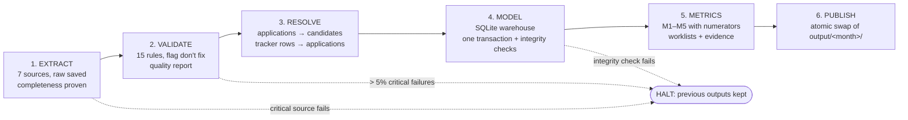

# The pipeline

## Run it

```bash
python run_pipeline.py --month 2026-08                          # one month
python run_pipeline.py --range 2026-02 2026-08                  # backfill, plus the cross-month summary
python run_pipeline.py --month 2026-08 --chaos job_board_down   # controlled failure
pytest                                                          # 52 tests, no network needed
```

The job-board API is a local mock of the vendor's API. The pipeline starts it automatically
(`sources.job_board_api.start_mock_api` in `config.yaml`). Exit code 0 means every month succeeded or ran degraded;
1 means at least one month halted.

## Stages



| Stage | Code | Output |
|---|---|---|
| Extract | [`pipeline/extract.py`](../pipeline/extract.py), [`pipeline/http.py`](../pipeline/http.py) | `data/raw/<source>/asof=<date>/<run_id>/` |
| Validate | [`pipeline/validate.py`](../pipeline/validate.py), [`pipeline/normalize.py`](../pipeline/normalize.py) | `failure_reasons` / `warning_reasons` on every row; quality report |
| Resolve | [`pipeline/resolve.py`](../pipeline/resolve.py) | candidate IDs, tracker links, review queue, matching-rule evaluation |
| Model | [`pipeline/model.py`](../pipeline/model.py), [`sql/schema.sql`](../sql/schema.sql) | `data/warehouse_asof=<date>.sqlite` |
| Metrics | [`pipeline/metrics.py`](../pipeline/metrics.py), [`sql/metrics.sql`](../sql/metrics.sql) | metrics, worklist, review queue, sensitivity |
| Publish | [`pipeline/save.py`](../pipeline/save.py), [`pipeline/report.py`](../pipeline/report.py) | `output/<month>/`, and `output/summary/` after `--range` |

## How we know retrieval is complete

| Source | Check |
|---|---|
| Job-board API | `total` read from the first page and required not to change during the pull; every page saved raw; records repeated across pages (offset drift) removed; unique records must equal `total` |
| Careers database | `SELECT COUNT(*)` with the same filter first; the data query must return exactly that many rows |
| Files (referral form, WhatsApp, mailbox, tracker, labelled pairs) | Required columns present; every line parsed or counted as unparsed; SHA-256 recorded |

Raw pulls are **write-once**: each run writes to its own folder, and a pull only counts once its `_SUCCESS.json`
exists, which records the checksum of every file and the completeness evidence.

## Failure handling: halt or degrade

Decided by how much the KPI depends on the source (`critical_sources` in `config.yaml`).

| Situation | Action | Why |
|---|---|---|
| Job-board API, careers database or tracker fails | **Halt** the month | The KPI can't be computed without them: 59% of applications and every screen |
| WhatsApp export, mailbox or referral form missing | **Degrade**: run, and say which channel is missing from every metric | Coverage drops, but the result is still meaningful and clearly labelled |
| Less than 90 days of history before the month | **Degrade** | M1 is understated; it's labelled so |
| > 5% of a source's rows fail a critical rule | **Halt** after writing the quality report | Something upstream is broken |
| Warehouse integrity check fails | **Halt**, nothing committed | The warehouse stays as it was |
| Any unexpected error | Recorded as `failed` in the run manifest, with the stage and error | Never a silent crash |

Network calls retry up to 4 attempts with 1, 2 and 4-second waits (honouring `Retry-After`) on timeouts, 429 and 5xx.
Other errors, such as 404, fail immediately, because retrying can't fix them.

### Controlled failures (`--chaos`)

| Scenario | What it simulates | Result |
|---|---|---|
| `job_board_down` | The vendor's API is unreachable | **Halts** after 4 attempts; previous outputs untouched |
| `tracker_schema` | Someone deletes the `Screened On` column from the sheet | **Halts**: `missing required columns ['Screened On'] - the sheet layout changed` |
| `whatsapp_missing` | The WhatsApp export wasn't provided | **Degrades**: publishes, labelled "whatsapp_export unavailable" |
| `mailbox_missing` | The mailbox export wasn't provided | **Degrades**, labelled |
| `referrals_missing` | The referral form export wasn't provided | **Degrades**, labelled |

A chaos run **never** writes to `output/` or to the real warehouse: its results go to `logs/chaos_outputs/<scenario>/`,
so a test can't overwrite what a real consumer reads.

## Rerun behaviour

- **Point-in-time:** a run as of a month end only sees what existed by then, so a backfill reproduces what could
  have been known each month.
- **Atomic publish:** outputs are written to a staging folder, then swapped into `output/<month>/` in one rename. A
  crash leaves either the old outputs or the new ones, never a mix. If a rerun fails, the previous good outputs stay.
- **Deterministic:** rows are sorted and written the same way every time, so a rerun gives **byte-identical**
  outputs; only the run ID and timestamps in the manifest change.

## Run manifest

Every run writes a manifest: status, the stage where it halted and why, degraded notes, each source's status and
completeness evidence, every rule's count, the warehouse's table counts and integrity checks, a checksum of every
output file, the **git commit** of the code and whether it had uncommitted changes, and a **hash of
`config.yaml`**.

- `logs/manifests/run_<run_id>_<month>.json`: every run, including failed ones.
- `output/<month>/run_manifest.json`: only when outputs were published, so it always describes the files next to it.

The cross-month summary refuses to combine months produced by different code or configuration.

## Tests

`pytest` runs 52 tests without network access:
- **Normalisation:** phone, email and name formats; Gmail dot rules; placeholders; tracker dates.
- **Identity resolution:** siblings sharing a phone aren't merged; a nameless record can't bridge two people;
  referrers' numbers are ignored; false merges are counted correctly.
- **Retrieval:** transient errors retried and bounded; non-retryable errors fail fast; WhatsApp parsing.
- **Validation:** status mapping, double imports, point-in-time cut-offs.
- **Simulator:** generating twice under different Python hash seeds gives byte-identical files, matching the committed ones.
- **End to end:** success then an identical rerun; a schema break halts and keeps the previous outputs; a missing
  source degrades; a chaos run never touches the real warehouse.
