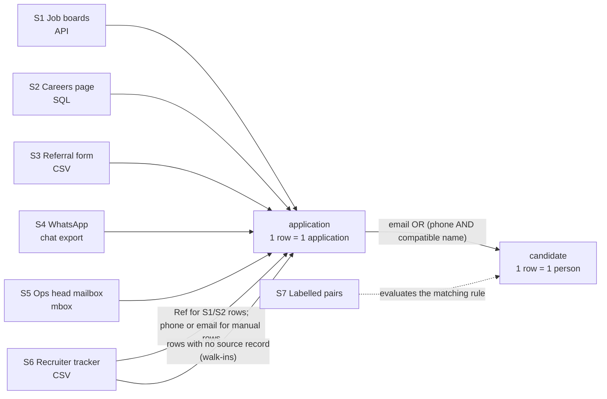

# Source map

How each business question leads to the information needed and the system that holds it, who owns each source,
what one row means, and what the sources can't tell us.

> All client data is simulated ([simulation.md](simulation.md)).

## Business question → information → source

| Business question | Information needed | Where it lives |
|---|---|---|
| Who has applied, through any channel? | Every application, with whatever identifies the person | S1–S5 (five intake channels) + walk-ins in S6 |
| Are two applications the same person? | Email, phone and name, normalised; proof of which rule is safe | S1–S5 identifiers + S7 labelled pairs |
| Did the recruiter screen this application, and when? | A row per logged application with a screening date | S6 recruiter tracker |
| Was the screen a waste (same person screened recently)? | Resolved identity + screening dates | Derived: S1–S6 joined through identity resolution |
| Did anything arrive that was never reviewed? | Applications with no tracker row, or never screened | S1–S5 compared against S6 |
| How long until an applicant hears back? | First-contact date per application | S6 (`First Contact`) |
| Do people re-apply because nobody replied (H2) or because channels are fragmented (H1)? | Re-applications by resolved identity, split by whether they heard back | Derived from S1–S6 |

## Sources

| # | Source | Owner | Retrieval mode | Grain (1 row =) | Identifiers present | Known gaps |
|---|---|---|---|---|---|---|
| S1 | Job boards (Indeed / Naukri) application API | Job-board vendor | **REST API**: paginated JSON, retries on 500/429 | one application | email 100%, name 100%, phone 68% | Pagination drifts (one record repeats across pages); some applicants hide their phone |
| S2 | Careers page database | Web / IT team | **SQL** (SQLite) | one form submission | email 100%, phone 98%, name 100% | Timestamps are stored in **UTC**, every other source is IST |
| S3 | Employee referral form (Google Form export) | Recruiter | **File**: CSV | one referral | name 100%, phone 87%, email 40% | Referrers sometimes type **their own** phone as the candidate's; email often a placeholder (`na`, `-`) |
| S4 | WhatsApp "Hiring - Ops" number (chat export) | Head of Ops (shared phone) | **File**: WhatsApp `.txt` export | one message | phone 100%, name 60%, email 10% | Applications are mixed with follow-ups, media and replies; many give no name |
| S5 | Head of Ops mailbox (applications emailed directly) | Head of Ops | **File**: `.mbox` export | one email | email 100%, name 75%, phone 39% | Mixed with internal mail and notifications |
| S6 | Recruiter's hiring tracker (Google Sheet export) | Recruiter | **File**: CSV | one row the recruiter logged | as typed by hand | Dates typed in mixed formats; free-text statuses (`NS`, `On hold`); the sheet holds only the *current* status, not a history; walk-ins exist only here |
| S7 | Recruiter-labelled pairs | Recruiter (created for this project) | **File**: CSV | one pair of records, labelled same / different person | — | 237 pairs; a sample, not a census |

Retrieval modes used: **API** (S1), **SQL** (S2), and **files** in three formats (CSV, WhatsApp text, mbox).

### How each source is proven complete

| Source | Completeness check |
|---|---|
| S1 API | Requested `total` is fixed at the first page; every page saved raw; duplicates across pages removed; unique records must equal `total`, and `total` must not change mid-pull |
| S2 SQL | `COUNT(*)` with the same filter runs first; the query must return exactly that many rows |
| S3–S7 files | Required columns present; every line parsed or counted as unparsed; SHA-256 of the file recorded |

## How the sources join

### Join decisions

- **Identity is resolved on email or phone, never on name alone.** Common names are shared by different people, and
  each channel writes names differently. The evidence for the exact rule is in
  [data_model.md](data_model.md#identity-resolution).
- **Tracker rows are linked to applications by the source's own ID where one exists.** The job-board and careers
  rows are auto-imported with a `Ref`. Hand-logged rows (WhatsApp, email, referrals) have no ref, so they are linked on
  same channel + same phone or email, logged within 21 days of applying. When one side has no usable phone or email
  (referral forms often lack the candidate's email), a row is linked on name only if **exactly one** unlinked
  application in that channel and window has a compatible name (41 rows). Anything else stays unlinked and is flagged
  (T08).
- **Walk-ins become applications of their own.** A tracker row with no source record behind it is still an
  applicant. Assignment 1 listed five channels; profiling found this sixth path in.
- **Every timestamp is converted to IST** before comparison, because S2 stores UTC.

## Gaps found in the sources

| Gap | Evidence | Consequence |
|---|---|---|
| No identifier exists across every channel | WhatsApp carries email in 10% of applications; job boards carry phone in 68% | Matching must combine email and phone; neither alone is enough |
| The tracker keeps only the latest status | One `Status` column, overwritten | The recruiter's decision history can't be reconstructed, only the current state |
| Some applications never reach the tracker | 10–13% of each month's applications have no tracker row after 30 days (M2a) | These people were never reviewed; they are invisible in the recruiter's own view |
| Statuses without an agreed meaning | `NS` (287 rows): "not suitable" or "no-show"? | Kept as `unclear`, not guessed; needs the recruiter to define it |
| Day/month-ambiguous dates | 9.9% of tracker dates (e.g. `03/04/2026`) | Read day-first (the sheet's convention) and flagged |
| No "rejection sent" event | Rejected applicants are never contacted | Time-to-first-response counts silence honestly: ~80% hear nothing within 30 days |
